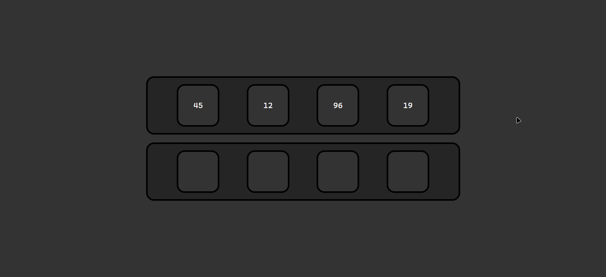
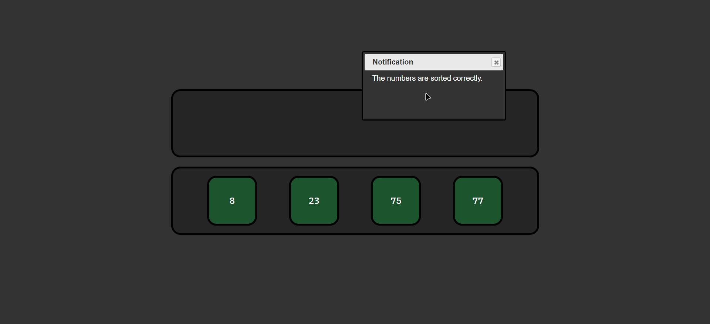

# 🧩 Simple Drag&Drop

This project is a simple drag and drop game where the user is required to sort numbers in ascending order (left to right) by dragging and dropping them into cells.

## 🛠️ Technologies Used

| Technology | Description | Link |
| :--- | :--- | :--- |
| HTML | 📝 Used for structuring the web content. | [Learn More](https://developer.mozilla.org/en-US/docs/Web/HTML) |
| CSS | 🎨 Used for styling the web content. | [Learn More](https://developer.mozilla.org/en-US/docs/Web/CSS) |
| JavaScript | 🚀 Used for creating interactive web content. | [Learn More](https://developer.mozilla.org/en-US/docs/Web/JavaScript) |
| jQuery | ⚡ A fast, small, and feature-rich JavaScript library. | [Learn More](https://jquery.com/) |
| jQuery UI | 🎉 A curated set of user interface interactions, effects, widgets, and themes built on top of the jQuery JavaScript Library. | [Learn More](https://jqueryui.com/) |

## 🚀 How to Run

To run this project, simply open the `index.html` file in a web browser. For a better experience, you can use the ["Live Server"](https://marketplace.visualstudio.com/items?itemName=ritwickdey.LiveServer) extension in Visual Studio Code to launch a development server with live reload feature for static & dynamic pages.

## 📸 Preview

  
   
  

